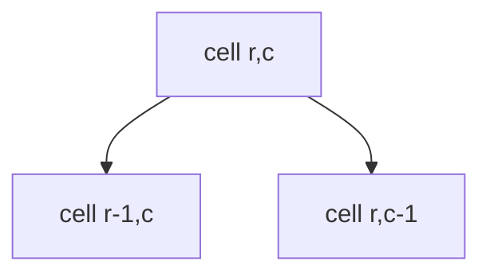

# Unique Paths

**Difficulty:** Medium
**Pattern:** 2D Grid DP
**LeetCode:** #62

## Problem Statement
A robot starts at top-left of an `m x n` grid and moves only right or down.
Return the number of unique paths to bottom-right.

## Input/Output Examples
1. Input: `m = 3, n = 7` -> Output: `28`
2. Input: `m = 3, n = 2` -> Output: `3`
3. Input: `m = 1, n = 5` -> Output: `1`

## Why This Is DP (overlapping + optimal substructure)
- Overlapping: path count to each cell is reused multiple times.
- Optimal substructure: paths to `(r,c)` = paths to `(r-1,c)` + paths to `(r,c-1)`.

## Mermaid Visual


## Brute Force (Python)
```python
def unique_paths_bruteforce(m, n):
    def dfs(r, c):
        if r == m - 1 and c == n - 1:
            return 1
        if r >= m or c >= n:
            return 0
        return dfs(r + 1, c) + dfs(r, c + 1)

    return dfs(0, 0)
```

## Optimal DP (Python)
```python
def unique_paths_dp(m, n):
    dp = [[1] * n for _ in range(m)]

    for r in range(1, m):
        for c in range(1, n):
            dp[r][c] = dp[r - 1][c] + dp[r][c - 1]

    return dp[m - 1][n - 1]
```

## DP Checklist
- Define the DP state clearly before coding.
- Identify base cases that stop recursion/iteration.
- Write recurrence from smaller subproblems.
- Ensure transitions are valid for problem constraints.
- Decide top-down memo vs bottom-up table.
- Check if state compression is possible.
- Verify behavior on empty or minimal inputs.
- Confirm impossible states are handled safely.
- Test with monotonic, random, and duplicate-heavy data.
- Re-check off-by-one around boundaries.

## Minimal Test Harness (Python)
```python
def run_small_cases(cases, solver):
    """Simple harness to quickly smoke-test a DP implementation."""
    results = []
    for args, expected in cases:
        if isinstance(args, tuple):
            got = solver(*args)
        else:
            got = solver(args)
        results.append((got, expected, got == expected))
    return results
```

## Complexity (brute force + optimal)
- Brute force recursion: approximately `O(2^(m+n))` time, `O(m+n)` stack.
- Optimal DP: `O(m * n)` time, `O(m * n)` space.
